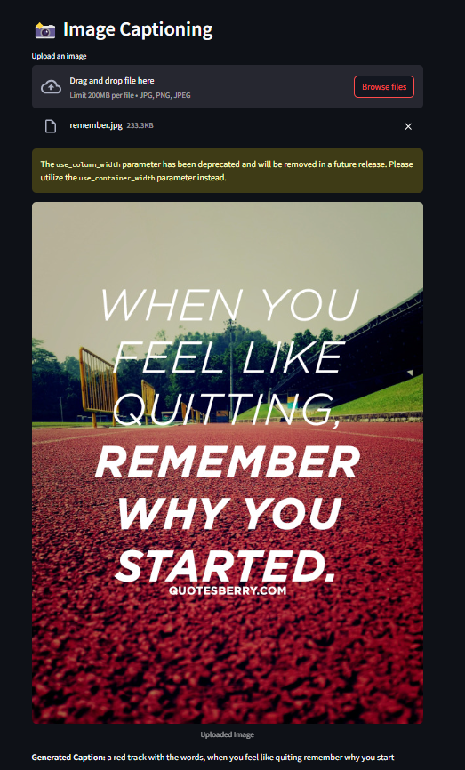
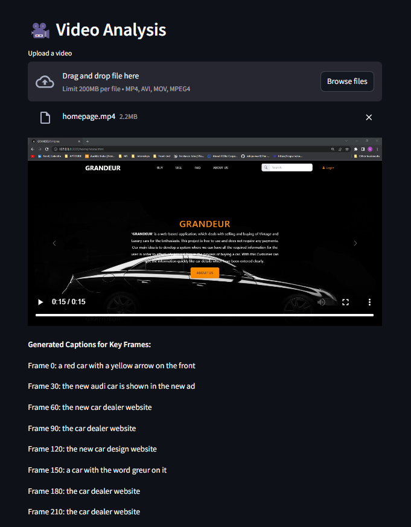
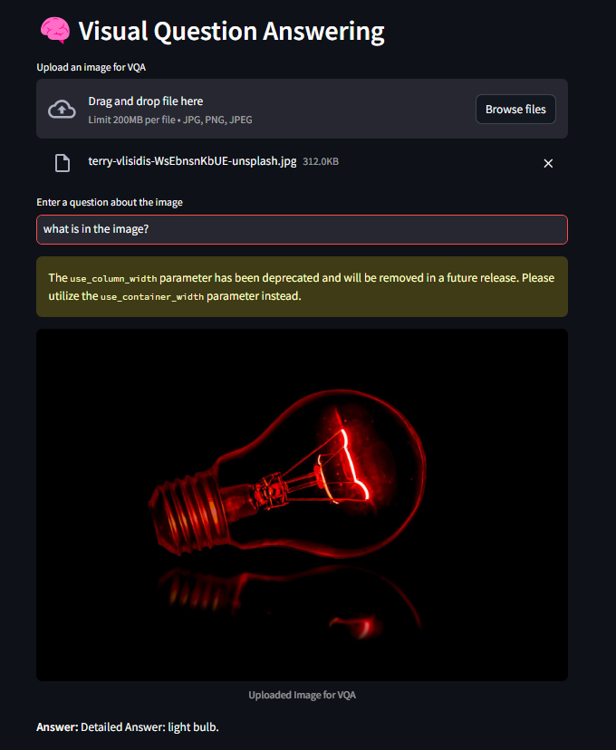
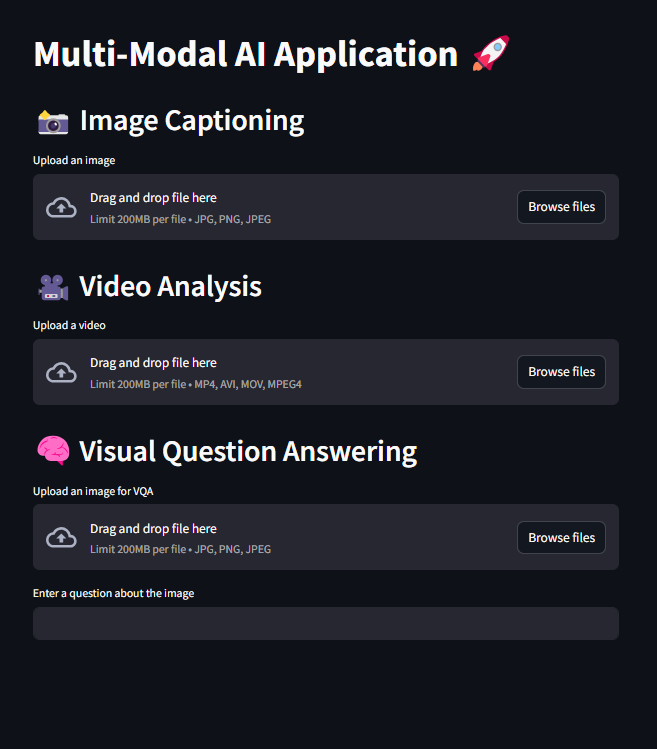

# 🚀 Multi-Modal AI Application

This project implements **Multi-Modal AI functionalities** using **Transformer-based models**, allowing users to:

- **📸 Image Captioning** – Generate captions for images.
- **🎥 Video Analysis** – Extract frames and generate captions.
- **🧠 Visual Question Answering (VQA)** – Answer questions about an uploaded image.

## ✨ Features

- Uses **Salesforce BLIP** models for Image Captioning & VQA.
- Implements **frame-wise analysis** for videos.
- Provides an **interactive UI** using **Streamlit**.
- Supports **GPU acceleration** if available.

---

## 📌 Installation

### **1️⃣ Clone the Repository**

```bash
git clone https://github.com/codebyrohith/multi-modal-ai-application.git
cd multi-modal-ai-application
```

### **2️⃣ Install Dependencies**

```bash
pip install -r requirements.txt
```

### **3️⃣ Run the Streamlit App**

```bash
streamlit run app.py
```

---

## 📷 Screenshots

### **1️⃣ Image Captioning**



### **2️⃣ Video Analysis**



### **3️⃣ Visual Question Answering (VQA)**



### **4️⃣ Full Application UI**



---

## 🔥 Usage Guide

1. **Upload an Image** → Get a caption.
2. **Upload a Video** → Get captions for key frames.
3. **Upload an Image + Ask a Question** → Get an AI-generated answer.

---

## ⚡ Project Structure

```
multi_modal_ai_project/
│── models/
│   ├── image_captioning.py  # Image Captioning Model
│   ├── video_analysis.py    # Video Analysis Model
│   ├── vqa.py               # Visual Question Answering Model
│── static/
│   ├── example_image.jpg    # Sample Image
│   ├── example_video.mp4    # Sample Video
│   ├── screenshots/         # Folder for screenshots
│── app.py                   # Streamlit UI
│── requirements.txt          # Dependencies
│── README.md                 # Documentation
```
